# Brana Audiobooks App Documentation

Welcome to the documentation for the Brana Audiobooks app. This document provides a user perspective to offer a comprehensive understanding of the application.

## User Documentation

## 1. Splash Screen

The Brana Audiobooks splash screen serves as the initial screen upon launching the app. Its purpose is to create a smooth and engaging transition for users while essential background tasks are executed.


### Interface Element:
The splash screen features the Brana Audiobooks logo at the center, creating a visually appealing introduction to the app.

### User Journey:
Onboarding Check:
The app checks if the user has completed the onboarding process.
If completed, the user is directed to the login page.
If not completed, the user is navigated to the onboarding screens.

```
Future<void> _checkOnboardingStatus() async {
  try {
    SharedPreferences prefs = await SharedPreferences.getInstance();
    bool hasCompletedOnboarding = prefs.getBool('hasCompletedOnboarding') ?? false;
    bool isLoggedOut = prefs.getBool('isLoggedOut') ?? true;
    bool isLoggedIn = prefs.getBool('isLoggedIn') ?? false;

    if (isLoggedOut) {
      // User is logged out, navigate to login page
      _navigateToLogin();
    } else if (isLoggedIn) {
      // User is logged in, navigate to homepage
      _navigateToHomePage();
    } else if (hasCompletedOnboarding) {
      // Onboarding has been completed, navigate to LoginPage
      _navigateToLoginPage();
    } else {
      // Onboarding has not been completed, navigate to Onboarding
      _navigateToOnboarding();
    }
  } catch (e) {
    // Handle exceptions if any
    print('Error checking onboarding status: $e');
  }
}
```
### Login Status Check:
The app verifies if the user is currently logged in.
If logged in, the user is directed to the home page.
If not logged in, the user is navigated to the login page.

### Navigation Timing:
The splash screen displays for a brief moment (2 seconds) to provide a smooth transition.
After the specified time, users are automatically redirected based on the app's logic.


## 2. Signup page
The Sign-Up Page is where users can create a new account to access the features and content of the Brana Audiobooks app. This page collects necessary information from users to create their accounts securely.

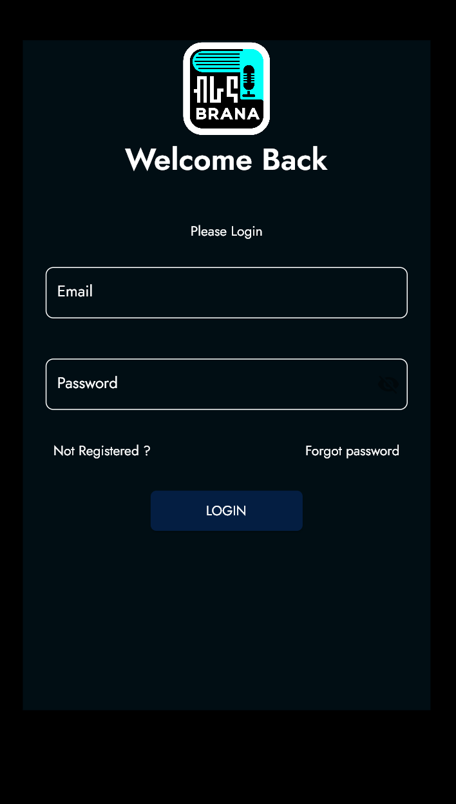

### Interface Element:
User-friendly Interface:
The page presents a clean and intuitive design, making it easy for users to navigate and fill in their details.

### User journey 
### Form Validation:
The form includes validation checks for each input field to ensure that users provide accurate and appropriate information.

### Secure Sign-Up Process:
The sign-up process communicates with the Brana Audiobooks server securely to register users.

### Error Handling:
In case of any errors during the sign-up process, users will receive informative error messages to guide them on resolving issues.

### Success Notification:
Upon successful sign-up, users receive a confirmation dialog indicating that the registration process was successful.

### Navigation:
Users can navigate between different input fields smoothly, and the page includes a back button for easy navigation.

## 3. Login Page
The Login Page is where users can access their Brana Audiobooks accounts by entering their email and password. This page is designed to provide a secure and straightforward login experience.
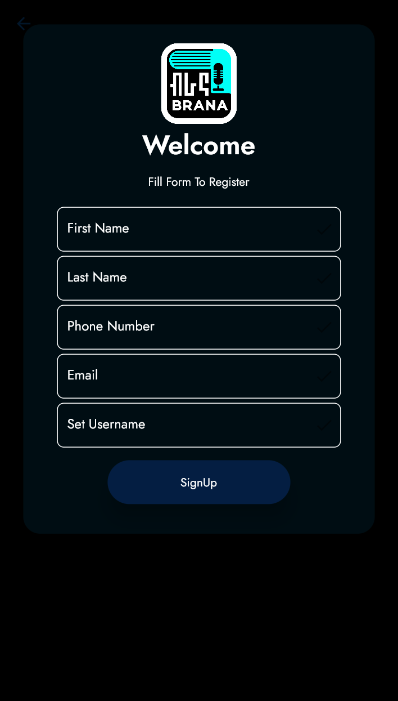
### Interface Element
### User-friendly Interface:
The page presents a clean and intuitive design, making it easy for users to navigate and enter their login credentials.

### User journey 
Form Validation:
The login form includes validation checks to ensure that users provide the necessary information and receive appropriate feedback.

### Password Visibility Toggle:
Users can toggle the visibility of the password field, providing the option to view or hide their entered password.

### Navigation Options:
Users can navigate to the Signup Page or the Forgot Password Page directly from the Login Page.

### Login Button:
The "LOGIN" button initiates the login process securely, verifying user credentials with the Brana Audiobooks server.

## 4. Home Screen:
Upon launching the app, users are presented with a Home Screen featuring recommended audiobooks, curated picks, and dedicated content for children.
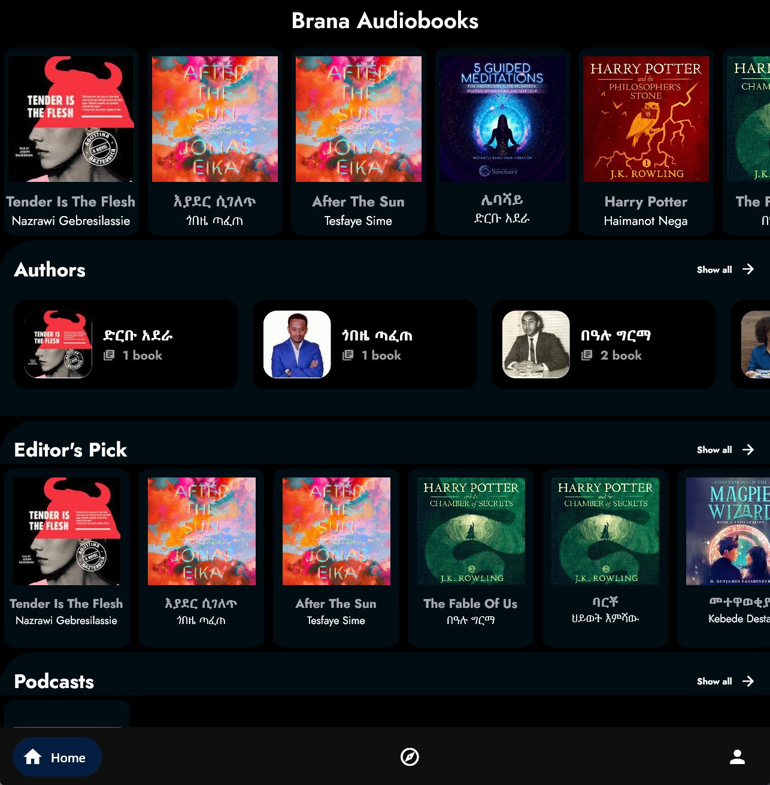
### Interface Elements 
### Authors Section:
Authors: Explore a diverse collection of authors by tapping on the "Authors" section. The "Show all" option allows users to access a comprehensive list of authors.

### Editor's Picks:
Editor's Picks: Discover noteworthy audio books curated by editors. The "Show all" option provides access to the full list of editor-recommended audiobooks.


### Podcasts Section:
Podcasts: Immerse yourself in the world of podcasts by navigating to the dedicated "Podcasts" section. The "Show all" option enables users to explore the complete podcast library.
### Children's Section:
Children: Tailored content for young listeners is available in the "Children" section. Users can view all children's content by selecting the "Show all" option.
### Connectivity Check:
The app checks for internet connectivity at launch. If there's no internet connection, a preloader indicates that certain features may be limited until a connection is established.


## 5. Explore page 
The Explore Page is a central hub for discovering new audiobooks and genres. It provides a visually appealing and user-friendly interface for users to explore various genres, access curated lists, and discover audiobooks based on their preferences.
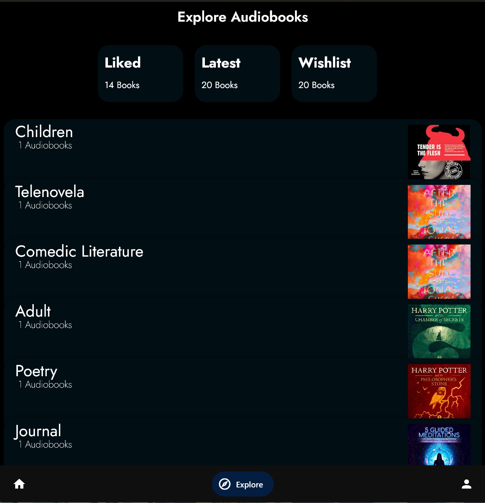

### Interface Elements
Genre Exploration:
The page displays a list of audiobook genres with associated information such as genre name, audiobook count, and a thumbnail image.

### Interactive Genre Widgets:
Each genre is presented as an interactive widget, allowing users to tap on a genre to view more details and explore specific audiobooks within that genre.

### Categories Scroller:
A horizontal scroller at the top of the page showcases different categories such as Liked, Latest, and Wishlist, providing quick access to specific audiobook collections.

### Responsive Design:
The page is designed to be responsive, adapting to different screen sizes for an optimal user experience.
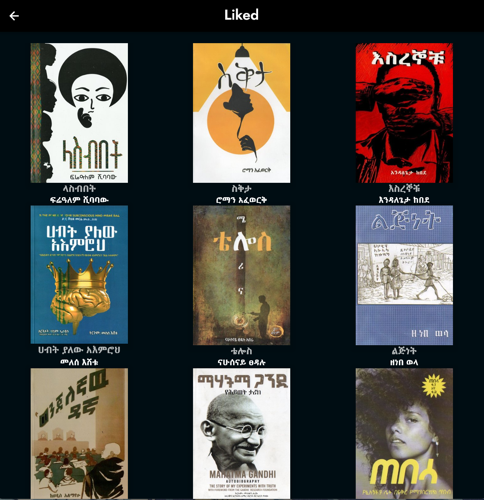
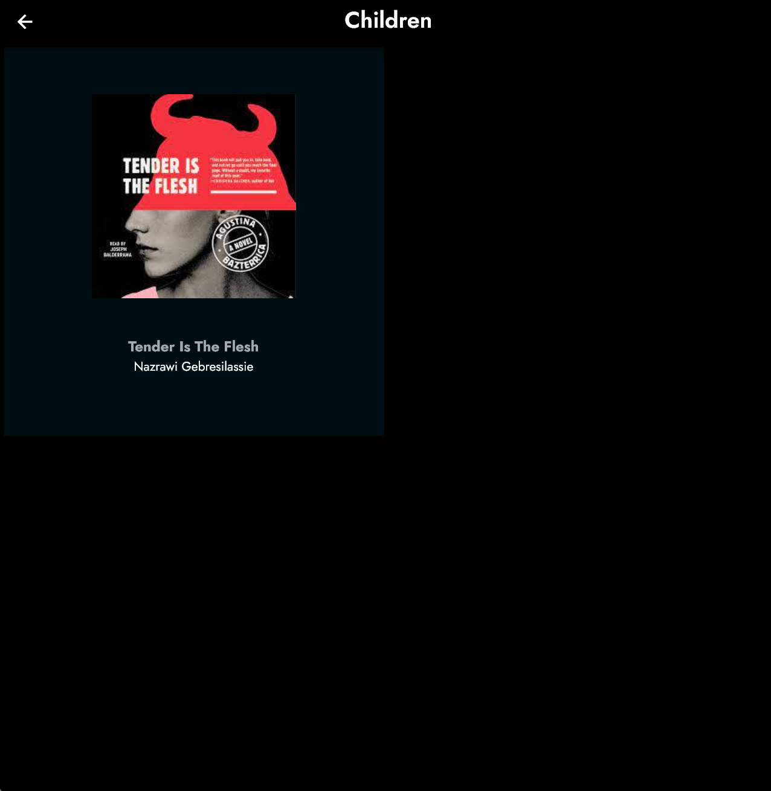

## 6. Profile page 
The Profile Page serves as a personalized space for users to manage their account information, view statistics, and customize their profile. This documentation will walk you through the key features and functionalities of the Profile Page.

## Interface Elements 
User Information:
Displays essential user information, including the user's name, email and profile picture.

### View Profile Button:
Allows users to view and edit  their profile information by tapping on the "Edit Profile" button.
Redirects users to the Edit Name Form Page for modifying their profile details.
-07.png)
### Settings Icon:
Located in the app bar, the settings icon provides quick access to the Settings Page for further customization.

## 7. Setting  page 
The Brana Audiobooks Settings Page provides users with the ability to manage account preferences and privacy settings. This documentation outlines the available settings and guides users on how to interact with them.
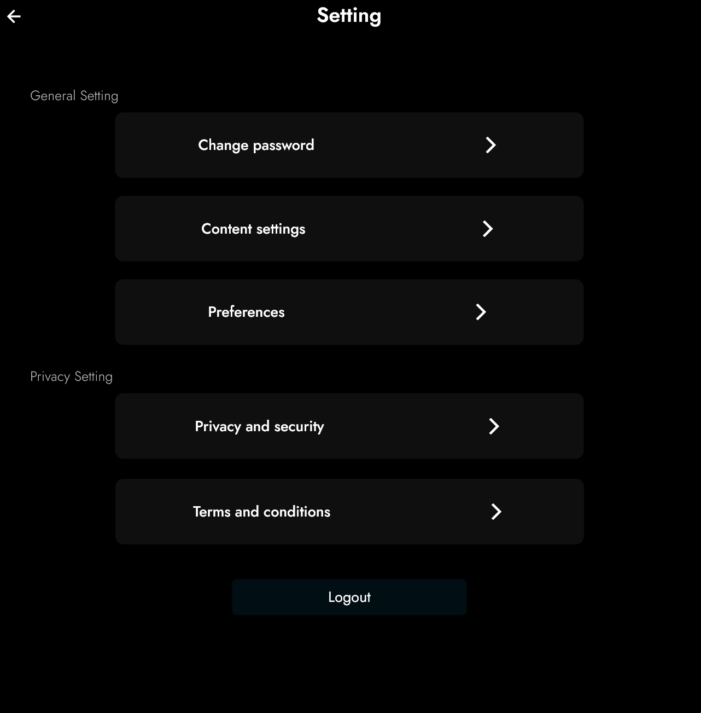
### Interface Elements 
### General Settings
### Change Password
To update your password:
Tap on the "Change Password" option.
In the displayed dialog:
Enter your old password.
Enter your new password.
Tap the "Update" button to confirm the changes.

### Content Settings
To manage content-related preferences:
Tap on the "Content settings" option.
In the pop-up dialog, you can find options related to explicit content, children's content, and more.

### Preferences
For additional preferences:
Tap on the "Preferences" option.
Explore and modify any available preferences presented in the dialog.

### Privacy Settings
Privacy and Security
To configure privacy and security settings:
Tap on the "Privacy and security" option.
In the displayed dialog, explore and configure privacy and security preferences.

### Terms and Conditions
To view the Terms and Conditions:
Tap on the "Terms and conditions" option.
Read the displayed Terms and Conditions for Brana Audiobooks.

### Logging Out
To log out of your Brana Audiobooks account:
Tap on the "Logout" button.
In the confirmation dialog:
Choose "Logout" to confirm.
Choose "No" to cancel.

## 8. Authors list  page
The Authors List Page is designed to showcase a curated list of authors associated with Brana Audiobooks. Each author entry provides relevant information about their collection.
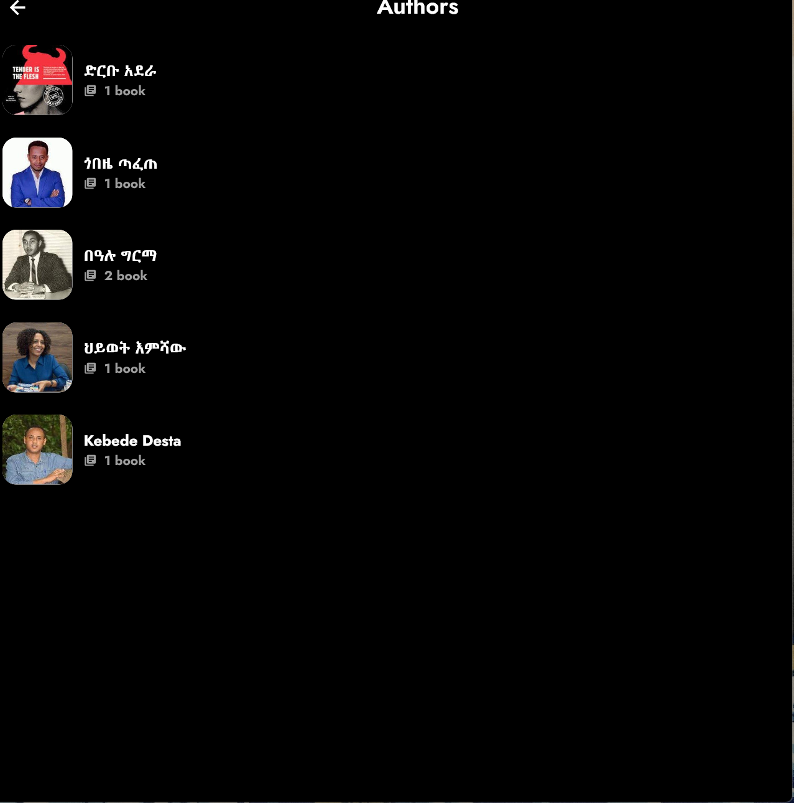
### Interface Elements 
### Authors List Display
### Author Information:
The page displays authors in a visually appealing format. Each author entry includes the following details:
Author Image: An image representing the author.
Author Name: The full name of the author.
Total Books: The number of books available from the author.


### User journey 
You can interact with the authors displayed on the page:
Tap on an Author: By tapping on an author entry, you can view more details about the selected author on a dedicated page.

### Additional Features 
### Sorting Authors:
Authors on the page may be sorted based on specific criteria. While viewing the authors, check for any sorting options available on the page.
Searching for Authors:
If you are looking for a specific author, you can use the search functionality. Look for a search bar or icon on the page and enter the author's name.


## 9. Authors solo  page
The Authors Solo Page offers an immersive experience, allowing users to explore an author's works in depth. You'll find information about the author, their image, and a list of audiobooks associated with them.
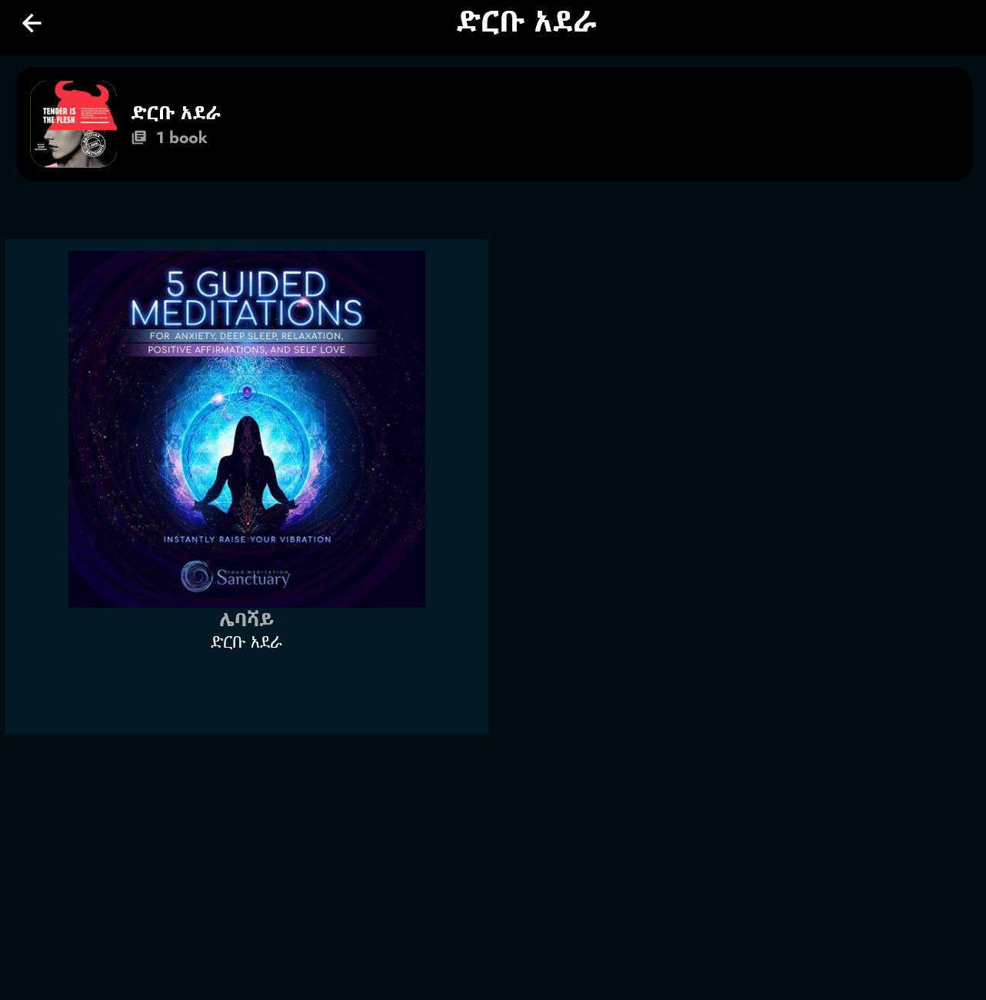


### User Journey 
To access the Authors Solo Page, first, navigate to the "Authors" section from the main menu of the Brana Audiobook application. Select the desired author from the Authors List Page by tapping on their entry.

### Authors Information
### Author Image and Details:
The top section of the page presents the author's image, name, and the total number of books attributed to them. This information is displayed prominently to provide a quick overview.

### Navigating Back:
To return to the Authors List Page or the previous screen, tap the back arrow icon located in the top-left corner of the app.

### Author's Audiobooks
Audiobook Grid:
Beneath the author's details, you'll find a grid displaying the author's audiobooks. Each audiobook entry includes its thumbnail, title, and the author's name.

### Interacting with Audiobooks:
Tap on an Audiobook: By tapping on an audiobook, you can view more details about the selected audiobook on a dedicated page, including the title, author, description, and additional information.

### Additional Features
Thumbnail Images:
Thumbnail images associated with each audiobook provide a visual representation of the content, making it easier for users to identify and explore specific audiobooks.


### Favorite Status:
Audiobooks may have a "favorite" status, indicating whether the user has marked them as a favorite. This status is visible in the individual audiobook details.


## 10. Editors Picks Page 
The Editors Picks page in the Brana Mobile app showcases a curated selection of audiobooks recommended by the editorial team. Users can explore these picks, view details about each audiobook, and navigate to the book details page for more information.
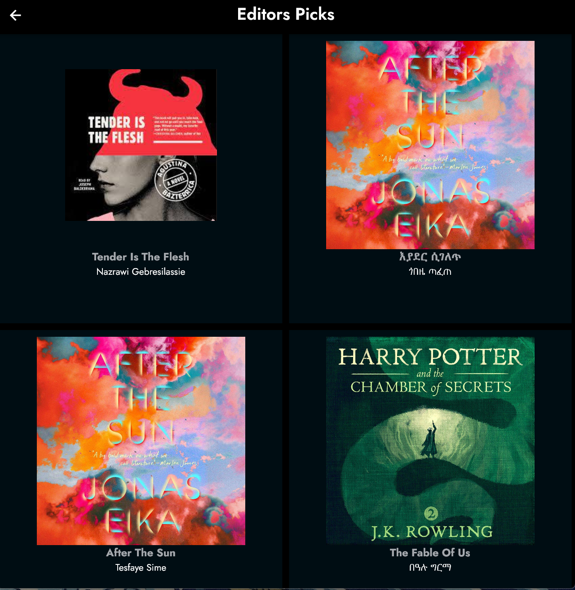

### User journey 
The "Editors Picks" section, usually available in the main menu or home screen.
Once on the Editors Picks page, you'll see a grid of audiobook covers, titles, and authors.

### Interface Elements
App Bar
Back Button: Located in the top-left corner, allows you to navigate back to the previous screen.
Title: Displays "Editors Picks" in the center of the app bar.

### Audiobook Grid
Thumbnail: Displays the cover image of each audiobook. Tap on a thumbnail to view detailed information about the corresponding audiobook.
Title and Author: Below each thumbnail, you'll find the title and author of the audiobook.

### Navigation
Tap on Audiobook Thumbnail: To view detailed information about a specific audiobook, tap on its thumbnail. This will navigate you to the Book Detail page.
Book Detail Page : On the Book Detail page, you can find more information about the selected audiobook, including the title, author, description, and narrator.

### Additional Features
Dynamic Grid: The audiobooks are displayed in a dynamic grid layout, adapting to the screen size.
Cached Images: Thumbnail images are cached for a smoother browsing experience.

````
  child: CachedNetworkImage(
                                  imageUrl: widget.thumbnail,
                                  fit: BoxFit.cover,
````

## 11. Podcast page
The Podcast page in the Brana Mobile app provides users with a collection of podcasts for an engaging listening experience. Users can explore various podcasts, view details about each episode, and access additional information such as the host, description, and cover image.
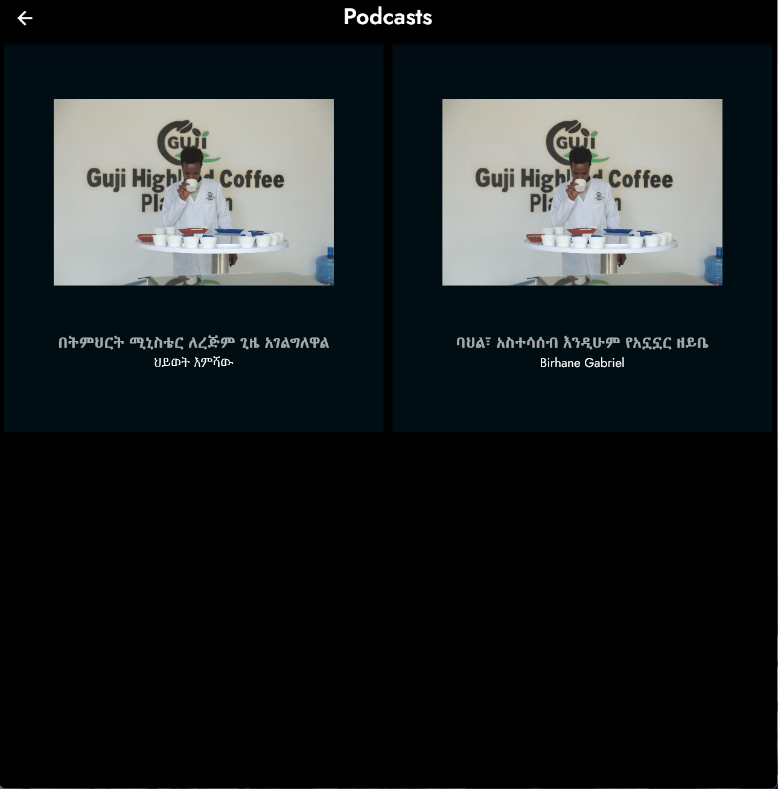

### User Journey 
The "Podcasts" section, typically available in the main menu or home screen.

### Explore Podcasts:
Once on the Podcast page, you'll find a grid layout displaying podcast covers, titles, and hosts.

### Interface Elements
App Bar
Back Button: Located in the top-left corner, this button allows you to navigate back to the previous screen.
Title: Displays "Podcasts" in the center of the app bar.

### Podcast Grid
Cover Image: Represents each podcast episode with a cover image. Tap on a cover image to view detailed information about the corresponding podcast.
Title and Host: Below each cover image, you'll find the title of the podcast and the name of the host.

### Navigation
Tap on Podcast Cover Image: To view detailed information about a specific podcast, tap on its cover image. This action will navigate you to the Podcast Detail page.

### Podcast Detail Page : On the Podcast Detail page, you can find more information about the selected podcast, including the title, host, description, and cover image.
Additional Features
Dynamic Grid: The podcasts are displayed in a dynamic grid layout, adjusting to the screen size.
Cached Images: Cover images are cached for a smoother browsing experience.

## 12. Children page
The Children's Audiobooks page in the Brana Mobile app is a dedicated section where users can discover and explore a variety of audiobooks suitable for children. This section provides a curated collection of audiobooks with engaging stories and content designed for a younger audience.


## 13. Book Detail


### User journey 
The "Children" section, often available in the main menu or home screen.
Once on the Children's Audiobooks page, you'll find a grid layout displaying audiobook covers, titles, and authors suitable for children.

### Interface Elements
App Bar
Back Button: Located in the top-left corner, this button allows you to navigate back to the previous screen.
Title: Displays "Children" in the center of the app bar.

### Audiobook Grid
Cover Image: Represents each children's audiobook with a cover image. Tap on a cover image to view detailed information about the corresponding audiobook.

### Title and Author: Below each cover image, you'll find the title of the audiobook and the name of the author.

### Navigation
Tap on Audiobook Cover Image: To view detailed information about a specific children's audiobook, tap on its cover image. This action will navigate you to the Book Detail page.
Book Detail Page : On the Book Detail page, you can find more information about the selected children's audiobook, including the title, author, description, and cover image.

### Additional Features
Dynamic Grid: The audiobooks are displayed in a dynamic grid layout, adapting to the screen size.
Cached Images: Cover images are cached for a smoother browsing experience.
```

children: [
                    Padding(
                      padding: const EdgeInsets.only(top: 10),
                      child: audiobook['thumbnail'] != null
                          ? CachedNetworkImage(
                              imageUrl: audiobook['thumbnail'],
                              width: 120,
                              height: 120,
                            )
                          : const SizedBox.shrink(),
                    ),
```
