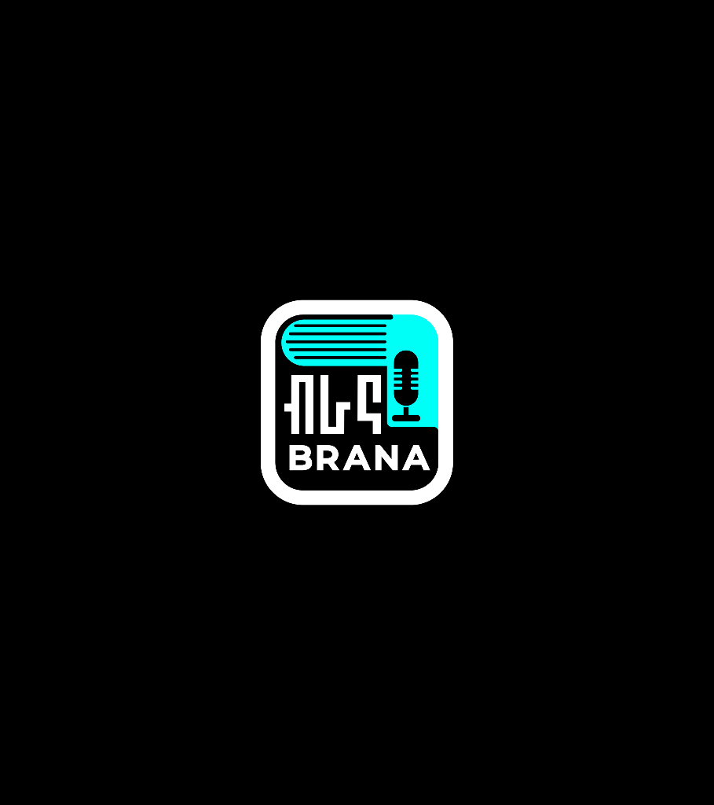

# Brana Audiobooks App Documentation

Welcome to the documentation for the Brana Audiobooks app. This document provides a user perspective to offer a comprehensive understanding of the application.

## User Documentation

### 1. Splash Screen

The Brana Audiobooks splash screen serves as the initial screen upon launching the app. Its purpose is to create a smooth and engaging transition for users while essential background tasks are executed.

### Interface Element:
The splash screen features the Brana Audiobooks logo at the center, creating a visually appealing introduction to the app.

### User Journey:
Onboarding Check:
The app checks if the user has completed the onboarding process.
If completed, the user is directed to the login page.
If not completed, the user is navigated to the onboarding screens.

Future<void> _checkOnboardingStatus() async {
  try {
    SharedPreferences prefs = await SharedPreferences.getInstance();
    bool hasCompletedOnboarding = prefs.getBool('hasCompletedOnboarding') ?? false;
    bool isLoggedOut = prefs.getBool('isLoggedOut') ?? true;
    bool isLoggedIn = prefs.getBool('isLoggedIn') ?? false;

    if (isLoggedOut) {
      // User is logged out, navigate to login page
      _navigateToLogin();
    } else if (isLoggedIn) {
      // User is logged in, navigate to homepage
      _navigateToHomePage();
    } else if (hasCompletedOnboarding) {
      // Onboarding has been completed, navigate to LoginPage
      _navigateToLoginPage();
    } else {
      // Onboarding has not been completed, navigate to Onboarding
      _navigateToOnboarding();
    }
  } catch (e) {
    // Handle exceptions if any
    print('Error checking onboarding status: $e');
  }
}
